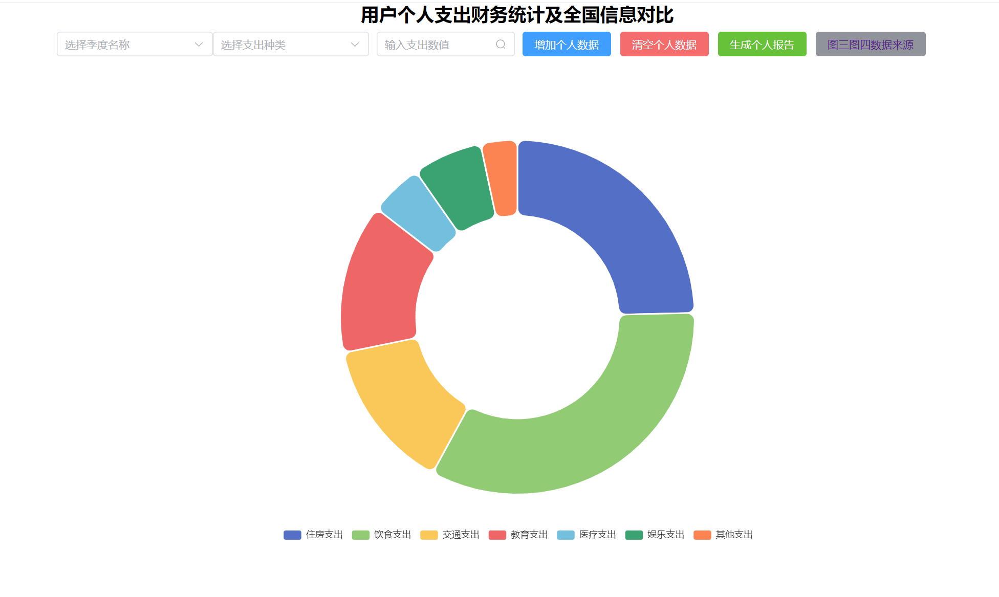
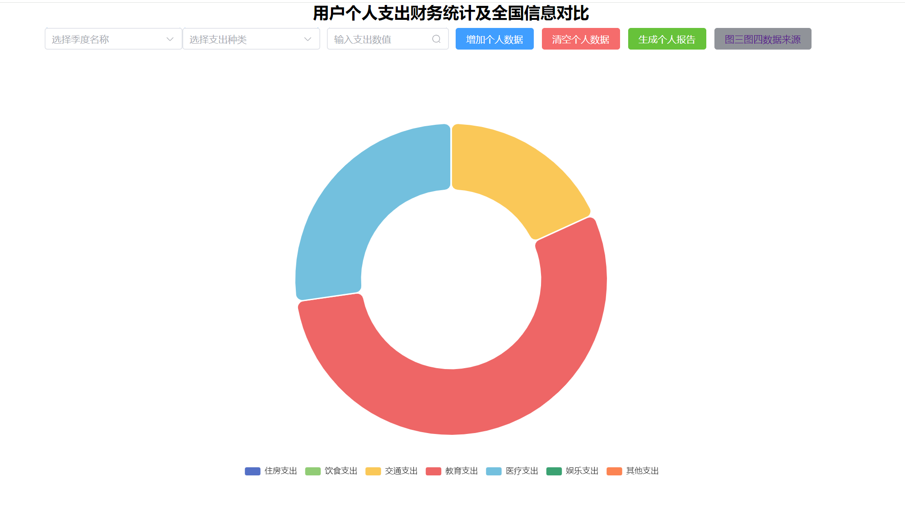
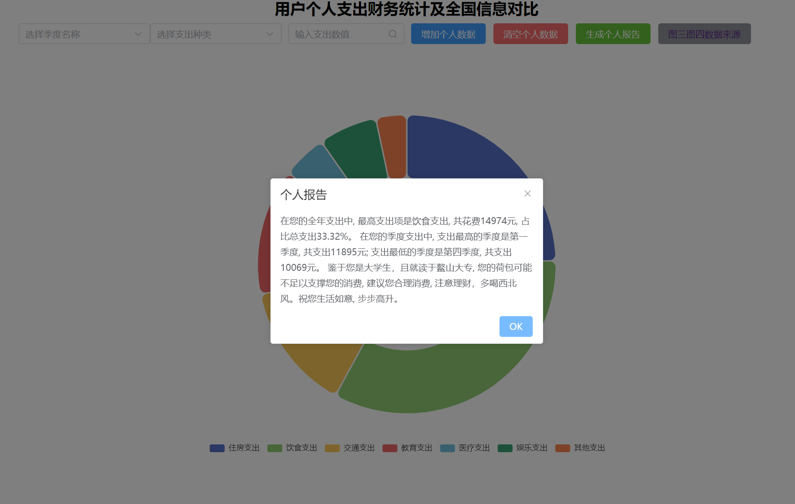
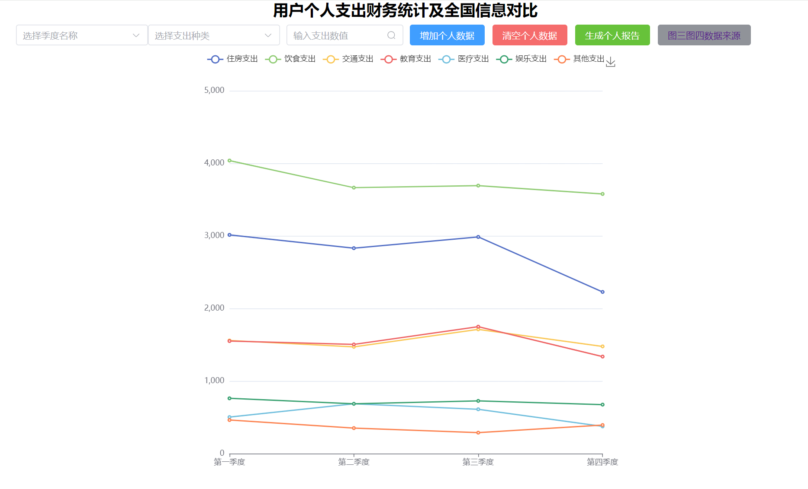
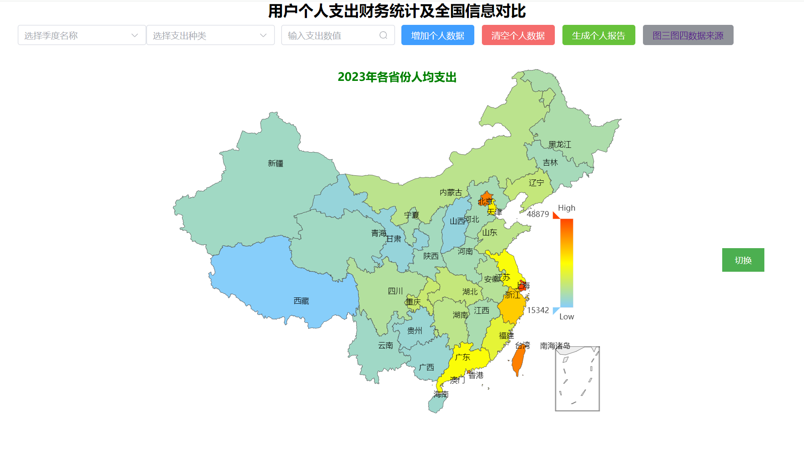
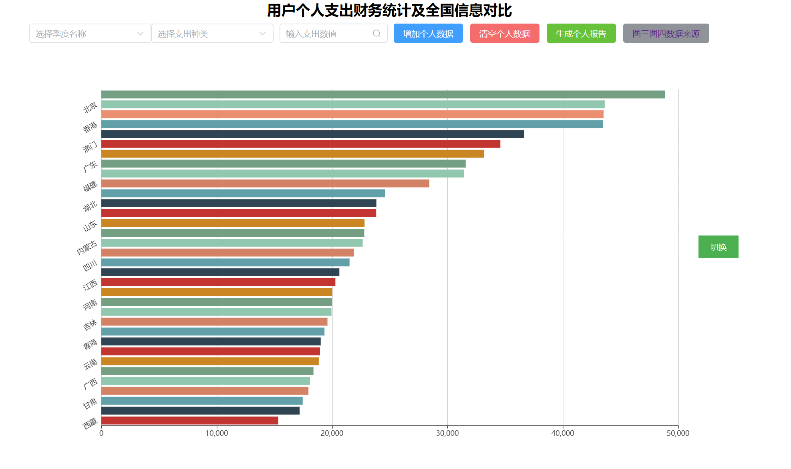
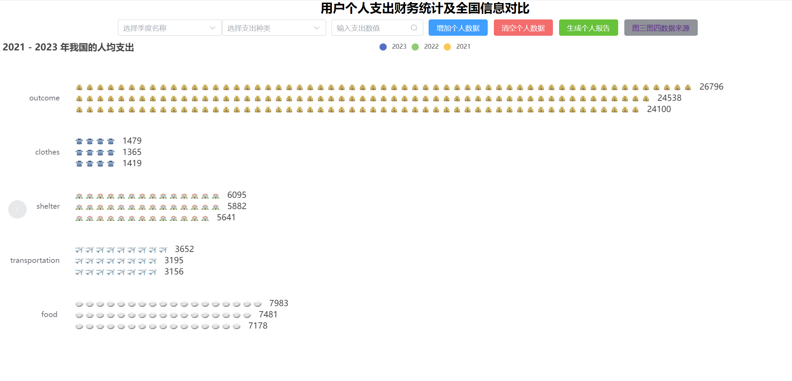

# DataVisDesign
# 基于用户个人支出财务的统计及全国信息对比

## 使用方法

本地运行时需要安装nodejs环境和vue环境，随后在终端中输入

```shell
npm run dev
```
打开弹出的网页即可

## 分工

可视化技术课程小组大作业,五人共同完成,共计五副图表

成员：zxe zhy ycy zzl lhn

## 简介

  该项目可以与用户的进行动态交互，来对用户的全年、不同季度的支出情况进行统计，同时对比全国的数据，来分析用户的支出情况，试图多角度全方位的来对用户的支出情况进行综合性的分析，以便用户更好的了解自身的支出情况，对生活产生一定的帮助。

  对于前两幅图表，支持动态的加入数据，清空数据，生成报告；用饼状图的形式分析不同类型支出在总支出的占比；用不同季度折线图的形式，来分析不同支出在不同季度上的变化情况。

  对于第三、四幅图表，数据来源于国家统计局2023年中国各省市农村与城镇居民人均年支出统计数据，图三使用中国地图在每个省市板块上面显示人均年支出效果会很好，可以观察到地处位置对人均年支出的影响，同时在同一省市下显示出人均年支出，城镇人均年支出和农村人均年支出具有鲜明对比性，信息展示更加全面。
  点击切换按钮可以切换成图四各省市人均年收入排名直方图，用于直观表示各省市人均年收入的比较。

  对于第五幅图表，数据来源于国家统计局2021-2023国家人均消费水平统计数据，展示了总人均支出和衣食住行这四个主要方面的支出，不同类型支出采用不同样式的图标，较为直观的展现不同年份之间以及不同类型之间支出的比较数据。

  项目技术栈vue+echarts

## 部分展示

图一

已有的数据。



支持用户增加数据，清空数据，
点击图片下方不同支出对应的颜色块可选择性隐藏和显示该块数据。



同时根据个人数据，生成个人报告。



图二

对图一的数据进行的折线图可视化，可根据图一的数据变动实时更新，
点击图片上方不同支出对应的折线段可选择性隐藏和显示该数据的变化折线。
点击下载按钮可将折线图保存到本地。



图三

地图显示，点击数据来源按钮可跳转到数据的来源网站（国家统计局官网）。



图四

按切换键切换到图四柱状图。



图五

用消费类型的对应符号填充的柱形图，
点击图片上方不同年份可选择性隐藏和显示该年份的数据。




